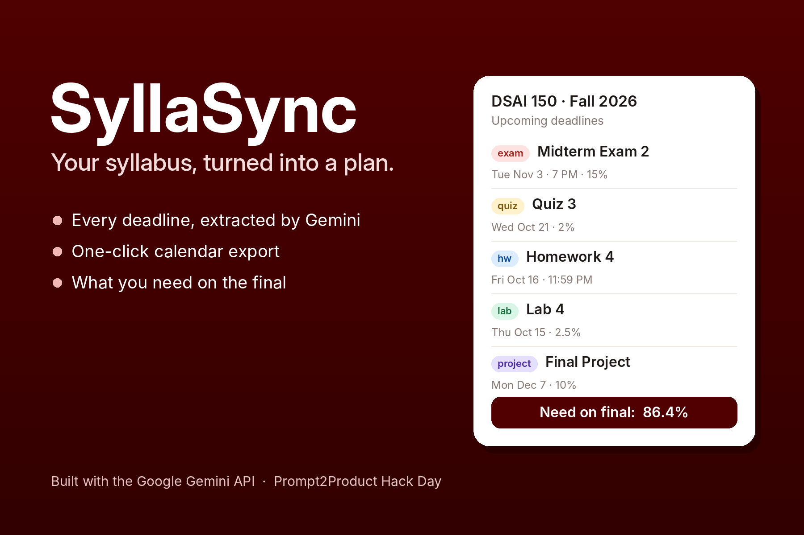
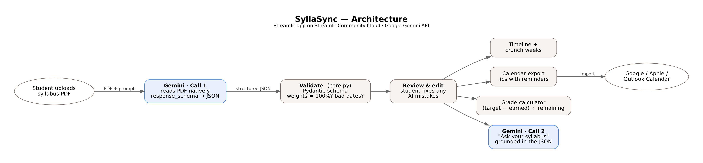

# 📅 SyllaSync

**Drop in any syllabus PDF. Gemini turns it into a synced calendar, a weighted grade tracker, and a "what do I need on the final?" calculator.**

Built for *Prompt2Product: MLH Hack Day @ AITR* by Rayha Manam.



## Features

| | |
|---|---|
| **Gemini reads the PDF directly** | No copy-pasting. Gemini handles tables, odd layouts, and phrases like "Thursday of Week 13". |
| **Structured output** | Gemini returns JSON matching a Pydantic schema (`core.py`), so every result has the same shape. |
| **Sanity checks** | Flags weights that don't add to 100%, TBA dates, and unknown categories. |
| **Review & edit** | AI can be wrong, so every extracted item is editable before you export. |
| **Calendar export** | One-click `.ics` with reminders for Google, Apple, or Outlook Calendar. |
| **Crunch weeks** | Shows the weeks with the most grade weight due, so you know when to start early. |
| **Grade calculator** | Enter your scores and see the average you need on the remaining work. |
| **Ask your syllabus** | A second Gemini call answers questions using only the extracted data. |

## Architecture



- **`app.py`**: Streamlit UI
- **`core.py`**: schema, Gemini prompts, validation, `.ics` export, grade math (no UI, fully testable)
- **`tests/test_core.py`**: unit tests for everything that doesn't call the API

The grade math is deliberately **not** done by the LLM. Gemini handles the fuzzy part (reading messy documents); plain Python handles the arithmetic, so the numbers are exact.

$$s_{\text{needed}} = \frac{G_{\text{target}} - \sum_{\text{graded}} w_i s_i}{\sum_{\text{remaining}} w_j}$$

## Run it locally

```bash
git clone https://github.com/<your-username>/syllasync.git
cd syllasync
python -m venv .venv && source .venv/bin/activate   # Windows: .venv\Scripts\activate
pip install -r requirements.txt
export GEMINI_API_KEY=your_key_here                  # Windows: set GEMINI_API_KEY=your_key_here
streamlit run app.py
```

Get a free API key at [Google AI Studio](https://aistudio.google.com/apikey). No key? Click **Try the demo syllabus** to explore the interface with a pre-built example.

Run the tests: `python tests/test_core.py`

## Prompts

All prompts (in-app and development) are in [`PROMPTS.md`](PROMPTS.md).

## What's next

- Direct Google Calendar sync (OAuth) instead of a file download
- Multi-course dashboard showing a whole semester's crunch weeks
- Canvas integration to pull real scores into the grade calculator
